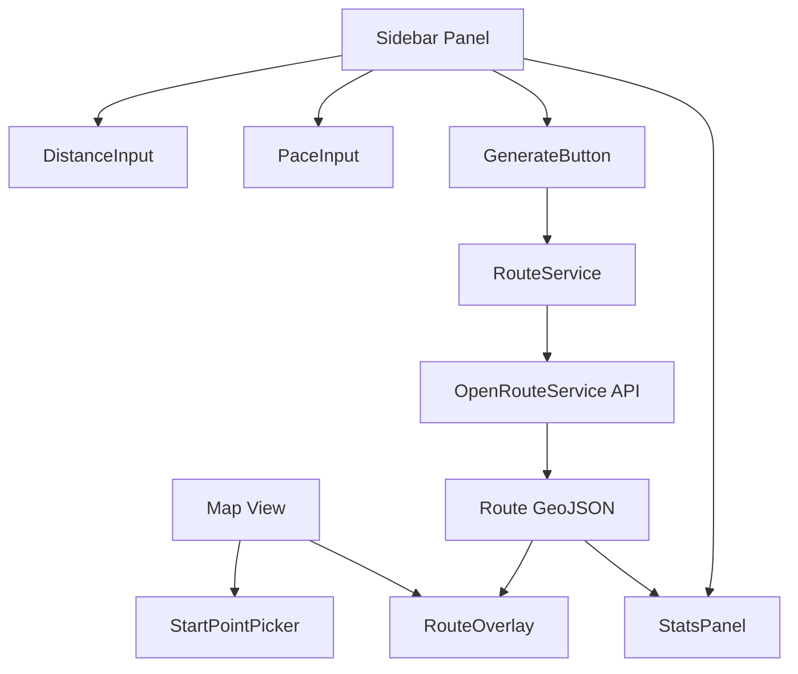

# 🏃 Running Route Planner — Implementation Plan

## Overview

A web app that lets a runner specify a target distance, then automatically generates a **random circular route** (starting and ending at the same point) displayed on an interactive map.

---

## Tech Stack

| Concern          | Choice                                          | Reason                                                       |
| ---------------- | ----------------------------------------------- | ------------------------------------------------------------ |
| Framework        | **Vite + React**                                | Fast dev server, great ecosystem                             |
| Map Library      | **Mapbox GL JS** or **Leaflet + OpenStreetMap** | Mapbox = premium UX; Leaflet = free, no API key needed       |
| Routing Engine   | **OpenRouteService API** or **GraphHopper API** | Both support circular route generation, free tiers available |
| Geolocation      | Browser `navigator.geolocation`                 | Native, no dependency needed                                 |
| Styling          | Vanilla CSS (dark, modern, premium)             | Per project standards                                        |
| State Management | React `useState` / `useReducer`                 | Lightweight, no Redux needed                                 |

> [!IMPORTANT]
> **Recommended pairing:** Leaflet + OpenRouteService (both free, no billing setup required). Mapbox GL JS is a premium upgrade if a polished look is the priority.

---

## Core Features

### 1. 📍 Starting Point

- **Auto-detect**: Use browser geolocation on load
- **Manual pin**: User can tap/click anywhere on the map to override the start
- Visual indicator (animated pulsing pin)

### 2. 📏 Distance Input

- Slider + numeric input (supports km and miles toggle)
- Suggested presets: 3 km, 5 km, 10 km, 21 km
- Instant visual feedback as they adjust

### 3. 🗺️ Route Generation

- Calls routing API with circular route parameters
- Random "seed" direction so repeated generations give different routes
- Routes are calculated on **actual roads/paths**, not straight lines
- Shows the full route polyline on the map with distance markers

### 4. 🔁 Regenerate

- "Shuffle" button to generate a different route with the same distance
- Slight random bearing offset each time for variety

### 5. 📊 Route Stats Panel

- Total distance (actual vs. requested)
- Estimated time (at configurable pace, e.g., 5:30/km)
- Elevation gain (if API supports it)
- Turn-by-turn waypoint count

### 6. 💾 Save / Share (Phase 2)

- Export route as GPX
- Shareable URL (encode route params in URL hash)

---

## Route Generation Algorithm

```
1. Get user's starting lat/lng (geolocation or map click)
2. Get target distance D
3. Pick a random bearing θ ∈ [0°, 360°)
4. Compute an intermediate waypoint at roughly D/π distance
   in direction θ (approximates circle circumference math)
5. Call routing API: start → waypoint → start (circular)
6. API returns actual road-snapped polyline
7. If returned distance differs from D by > 10%, adjust waypoint
   distance and retry (max 3 iterations)
8. Render polyline on map
```

> [!TIP]
> OpenRouteService has a dedicated **`/directions` with `round_trip`** options (length, points, seed) that handles steps 3–7 automatically. This is the cleanest implementation path.

---

## Architecture



---

## File Structure

```
running-route-planner/
├── index.html
├── src/
│   ├── main.jsx
│   ├── App.jsx
│   ├── index.css             ← Design system / tokens
│   ├── components/
│   │   ├── Map/
│   │   │   ├── MapView.jsx   ← Leaflet/Mapbox map container
│   │   │   ├── RouteLayer.jsx← Polyline + start/end markers
│   │   │   └── StartMarker.jsx
│   │   ├── Sidebar/
│   │   │   ├── Sidebar.jsx
│   │   │   ├── DistanceInput.jsx
│   │   │   ├── PaceSettings.jsx
│   │   │   └── RouteStats.jsx
│   │   └── UI/
│   │       ├── Button.jsx
│   │       ├── Toggle.jsx
│   │       └── Loader.jsx
│   ├── hooks/
│   │   ├── useGeolocation.js ← Auto-detect user position
│   │   └── useRoute.js       ← Route fetching + state
│   ├── services/
│   │   └── routeService.js   ← API calls to ORS/GraphHopper
│   └── utils/
│       ├── geoUtils.js       ← Bearing, distance math
│       └── formatUtils.js    ← Pace, time, distance formatting
├── package.json
└── vite.config.js
```

---

## UI/UX Design Direction

- **Dark mode** — deep slate/charcoal background, map fills the screen
- **Floating sidebar** — glassmorphism panel on the left (or bottom sheet on mobile)
- **Accent color** — electric green (`#00FF87`) or neon orange for the running vibe
- **Route color** — gradient polyline (start = green → end = blue)
- **Animated generation** — loading shimmer/spinner while route calculates
- **Mobile-first** — bottom panel that collapses/expands; map takes full screen

---

## API Options Comparison

| API                  | Free Tier     | Circular Route Support       | Elevation         | Notes             |
| -------------------- | ------------- | ---------------------------- | ----------------- | ----------------- |
| **OpenRouteService** | 2,000 req/day | ✅ Native `round_trip` param | ✅                | Best fit          |
| GraphHopper          | 500 req/day   | ✅ With custom waypoints     | ✅                | Good fallback     |
| Mapbox Directions    | 100k req/mo   | ❌ Manual waypoints needed   | ❌ (separate API) | Paid beyond free  |
| OSRM (self-host)     | Unlimited     | ❌ Manual                    | ❌                | No API key needed |

> [!NOTE]
> OpenRouteService is the clear winner for this use case. Sign-up is free and the `round_trip` option directly supports our core feature.

---

## Phased Delivery

### Phase 1 — Core MVP ✅ COMPLETE

- [x] Project scaffold (Vite + React)
- [x] Map view with geolocation
- [x] Distance input UI
- [x] ORS API integration for circular routes
- [x] Route display on map
- [x] Basic stats (distance, estimated time)

**Enhancements beyond scope:**

- [x] Full TypeScript conversion (zero JavaScript files)
- [x] Mobile-first responsive design (iPhone bottom sheet layout)
- [x] Improved color scheme (purple accent, better contrast)
- [x] Enhanced geolocation error handling
- [x] API key moved to environment variables (.env.local)

### Phase 2 — Polish ✅ COMPLETE

- [x] Pace customization (already implemented)
- [x] Unit toggle (km / miles) (already implemented)
- [x] Multiple route suggestions (generate 3 options)
- [x] Route color gradient (distance-based, green→blue)

### Phase 3 — Advanced

- [ ] GPX export
- [ ] Shareable URL
- [ ] Saved routes history (localStorage)
- [ ] Offline map tiles (PWA)

---

## Open Questions for User

1. **Map provider**: Leaflet (free/open) or Mapbox (premium visuals, requires account)?
2. **API key**: Comfortable signing up for a free OpenRouteService account, or prefer a fully no-login solution?
3. **Platform priority**: Mobile-first (bottom sheet UI) or desktop-first (sidebar)?
4. **Units**: Default to km or miles?
5. **Routing surface**: Roads only, or also include trails/parks (pedestrian mode)?
